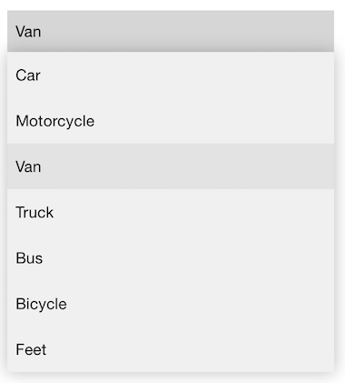
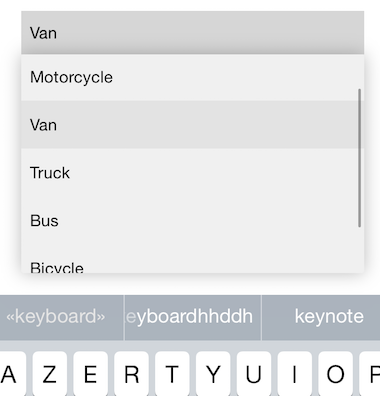

[](https://twitter.com/kevinh6113)
[](https://github.com/kevin-hirsch/KVNProgress/blob/master/README.md)
[](https://github.com/kevin-hirsch/DropDown)
[](http://cocoadocs.org/docsets/DropDown/)

A Material Design drop down for iOS written in Swift.
***

[](Screenshots/1.png)
[](Screenshots/2.png)

## Demo

Do `pod try DropDown` in your console and run the project to try a demo.
To install [CocoaPods](http://www.cocoapods.org), run `sudo gem install cocoapods` in your console.

## Installation

### CocoaPods

Use [CocoaPods](http://www.cocoapods.org).

1. Add `pod 'DropDown'` to your *Podfile*.
2. Install the pod(s) by running `pod install`.
3. Add `import DropDown` in the .swift files where you want to use it

### Source files

1. Download the [latest code version](http://github.com/kevin-hirsch/DropDown/archive/master.zip) or add the repository as a git submodule to your git-tracked project.
2. Drag and drop the **src**, **helpers** and also the **resources** directory from the archive in your project navigator. Make sure to select *Copy items* when asked if you extracted the code archive outside of your project.

## Usage

Create a new drop down:

```swift
let dropDown = DropDown()
```

Set the view to which the drop down will anchor:

```swift
let view = UIView()
dropDown.anchorView = view
```

Set the direction to use to show the drop down:

```swift
dropDown.direction = .Any
```

The default value is `.Any`. Here is the *Protocol* code:

```swift
enum Direction {

	/// The drop down will show below the anchor view when possible, otherwise above if there is more place than below.
	case Any

	/// The drop down will show above the anchor view or will not be showed if not enough space.
	case Top

	/// The drop down will show below or will not be showed if not enough space.
	case Bottom

}
```

By default, the drop down will be shown onto to anchor view. It will hide it. If you want the drop down to be just below your anchor view when the direction of the drop down is `.Bottom`, you can precise an offset like this:

```swift
dropDown.bottomOffset = CGPoint(x: 0, y:dropDown.anchorView.bounds.height) // top of drop down will be at bottom of anchorView
```

If you set the drop down direction to `.Any` or `.Top` you can also precise the offset when the drop down will showed above like this:

```swift
dropDown.topOffset = CGPoint(x: 0, y:-dropDown.anchorView.bounds.height) // bottom of drop down will be at top of anchorView
```

Note the minus sign used here to offset to the top.

The default width of the drop down will be the same as the anchor view minus the offset. If you want a custom width, just set:

```swift
dropDown.width = 100
```

Set the data source:

```swift
dropDown.dataSource = ["Car", "Motorcycle", "Van"]
```

By default, the cells in the drop down have the `dataSource` values as text.
If you want a custom format for the cells, you can set `cellConfiguration` like this for example:

```swift
dropDown.cellConfiguration = { [unowned self] (index, item) in
  return "- \(item) (option \(index))"
}
```

When the user selects something, your `selectionAction` is called:

```swift
dropDown.selectionAction = { [unowned self] (index, item) in
  println("item \(item) at index \(index) selected.")
}
```

And if the user cancels the drop down, your `cancelAction` gets called:

```swift
dropDown.cancelAction = { [unowned self] in
  println("Drop down canceled")
}
```

You have 3 dismiss mode with the `DismissMode` enum:

- `OnTap`: a tap is needed to dismiss the drop down before being able to interact with the UI
- `Automatic`: no tap is needed to dismiss the drop down, as soon as the user interact with anything else than the drop down, the drop down is dismissed
- `Manual`: the drop down can only be dismissed manually (by code)

for example:

```swift
dropDown.dismissMode = .Automatic
```

You can (pre)select a row with:

```swift
dropDown.selectRowAtIndex(3)
```

And finally show and hide the drop down with:

```swift
dropDown.show()
dropDown.hide()
```

The data source is reloaded automatically when changing the `dataSource` property. If needed, you can reload the data source manually by doing:

```swift
dropDown.reloadAllComponents()
```

You can get info about the selected item this way:

```swift
dropDown.selectedItem() // returns a String?
dropDown.indexForSelectedRow() // returns an Index?
```

### Customize UI

You can customize these properties of the drop down:

- `textFont`: the font of the text for each cells of the drop down.
- `textColor`: the color of the text for each cells of the drop down.
- `backgroundColor`: the background color of the drop down.
- `selectionBackgroundColor`: the background color of the selected cell in the drop down.

You can change them through each instance of `DropDown` or via `UIAppearance` like this for example:

```swift
DropDown.appearance().textColor = UIColor.blackColor()
DropDown.appearance().textFont = UIFont.systemFontOfSize(15)
DropDown.appearance().backgroundColor = UIColor.whiteColor()
DropDown.appearance().selectionBackgroundColor = UIColor.lightGrayColor()
```

### Advanced usage

when calling the `show` method, it returns a tuple like this:

```swift
(canBeDisplayed: Bool, offscreenHeight: CGFloat?)
```

- `canBeDisplayed` tells if there is enough height to display the drop down. If its value is `false`, the drop down is not showed.
- `offscreenHeight`: if the drop down was not able to show all cells from the data source at once, `offscreenHeight` will contain the height needed to display all cells at once (without having to scroll through them). This can be used in a scroll view or table view to scroll enough before showing the drop down.

### Important

Don't forget to put:

```swift
DropDown.startListeningToKeyboard()
```

in your `AppDelegate`'s `didFinishLaunching` method so that the drop down will handle its display with the keyboard displayed even the first time a drop down is showed.

## Remains to do

- [ ] Handle landscape mode on iOS 7

## Requirements

* Xcode 6+
* iOS 7+
* ARC

## License

This project is under MIT license. For more information, see `LICENSE` file.

## Credits

DropDown was inspired by the Material Design version of the [Simple Menu](http://www.google.com/design/spec/components/menus.html#menus-simple-menus).

DropDown was done to integrate in a project I work on:<br/>
[](https://assis.to)

It will be updated when necessary and fixes will be done as soon as discovered to keep it up to date.

I work at<br/>
[](http://pinch.eu)

You can find me on Twitter [@kevinh6113](https://twitter.com/kevinh6113).

Enjoy!
