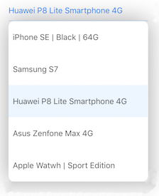

[](https://twitter.com/kevinh6113)
[](https://github.com/kevin-hirsch/KVNProgress/blob/master/README.md)
[](https://github.com/kevin-hirsch/DropDown)
[](http://cocoadocs.org/docsets/DropDown/)

A drop down for iOS in Swift (1.2).
***

[](Screenshots/1.png)
[](Screenshots/2.png)

## Installation

### Cocoapods

Use [CocoaPods](http://www.cocoapods.org).

1. Add `pod 'DropDown'` to your *Podfile*.
2. Install the pod(s) by running `pod install`.

### Source files

1. Download the [latest code version](http://github.com/kevin-hirsch/DropDown/archive/master.zip) or add the repository as a git submodule to your git-tracked project.
2. Drag and drop the **src**, **helpers** and also the **resources** directory from the archive in your project navigator. Make sure to select *Copy items* when asked if you extracted the code archive outside of your project.

## Usage

Create a new drop down:

```swift
let dropDown = DropDown()
```

Set the view to which the drop down will anchor:

```swift
let view = UIView()
dropDown.anchorView = view
```

By default, the dropdown will be shown from the point (0, 0). If you want the dropdown to be just below your anchor view, you can precise an offset like this:

```swift
dropDown.offset = CGPoint(x: 0, y:view.bounds.height)
```

The default width of the drop down will be the same as the anchor view minus the offset. If you want a custom width, just set:

```swift
dropDown.width = 100
```

Set the data source:

```swift
dropDown.dataSource = ["Car", "Motorcycle", "Van"]
```

When the user selects something, your `selectionAction` is called:

```swift
dropDown.selectionAction = { [unowned self] (index, string) in
  println("item \(string) at index \(index) selected.")
}
```

And if the user cancels the drop down, your `cancelAction` gets called:

```swift
dropDown.cancelAction = { [unowned self] in
  println("Drop down canceled")
}
```

You have 3 dismiss mode with the `DismissMode` enum:

- `OnTap`: a tap is needed to dismiss the drop down before being able to interact with the UI
- `Automatic`: no tap is needed to dismiss the drop down, as soon as the user interact with anything else than the drop down, the drop down is dismissed
- `Manual`: the drop down can only be dismissed manually (by code)

for example:

```swift
dropDown.dismissMode = .Automatic
```

You can (pre)select a row with:

```swift
dropDown.selectRowAtIndex(3)
```

And finally show and hide the drop down with:

```swift
dropDown.show()
dropDown.hide()
```

The data source is reloaded automatically when changing the `dataSource` property. If needed, you can reload the data source manually by doing:

```swift
dropDown.reloadAllComponents()
```

You can get info about the selected item this way:

```swift
dropDown.selectedItem() // returns a String?
dropDown.indexForSelectedRow() // returns an Index?
```

### Advanced usage

when calling the `show` method, it returns a tuple like this:

```swift
(canBeDisplayed: Bool, offscreenHeight: CGFloat?)
```

- `canBeDisplayed` tells if there is enough height to display the drop down. If its value is `false`, the drop down is not showed.
- `offscreenHeight`: if the drop down was not able to show all options from the data source at once, `offscreenHeight` will contain the height needed to display all options at once (without having to scroll through them). This can be used in a scroll view or table view to scroll enough before showing the drop down.

## Remains to do

- [ ] Handle landscape mode on iOS 7

## Requirements

* Xcode 6+
* iOS 7+
* ARC

## License

This project is under MIT license. For more information, see `LICENSE` file.

## Credits

DropDown was inspired by the Material Design version of the [Spinner](http://developer.android.com/guide/topics/ui/controls/spinner.html).

DropDown was done to integrate in a project I work on:<br/>
[](https://assis.to)

It will be updated when necessary and fixes will be done as soon as discovered to keep it up to date.

I work at<br/>
[](http://pinchproject.com)

You can find me on Twitter [@kevinh6113](https://twitter.com/kevinh6113).

Enjoy!
